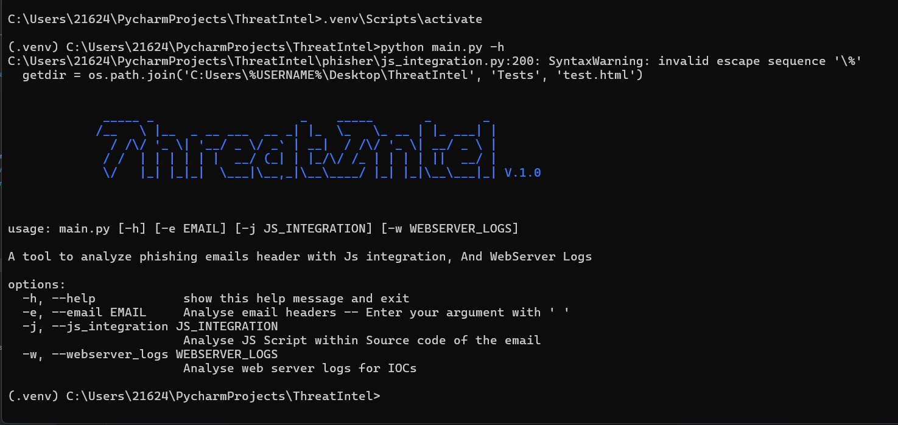

# ThreatIntel

A command-line threat intelligence tool for analyzing phishing emails and web server logs. It parses email headers, extracts JavaScript indicators of compromise, and scans Apache/Nginx access logs for attack patterns, then optionally queries VirusTotal for reputation data.





---

## Features

- Email header analysis with DKIM, SPF, and DMARC scoring
- JavaScript IOC extraction from email HTML payloads (atob, setTimeout, meta-refresh)
- Apache and Nginx access log scanning for SQL injection, command injection, and automated tool fingerprints
- IP attribution for every detected attack line
- Most-active IP and busiest day analysis
- VirusTotal reputation lookup for domains and IPs

---

## Requirements

- Python 3.10+
- pip packages listed in requirements below
- A VirusTotal API key (free tier works)
- Optional: a onesimpleapi token for URL unshortening

Install dependencies:

```
pip install requests python-dotenv beautifulsoup4
```

---

## Setup

Create a `.env` file in the project root:

```
VT_API=your_virustotal_api_key_here
TOKEN_EXPANDER=your_onesimpleapi_token_here
```

The `.env` file is gitignored and will never be committed.

---

## Usage

Run from the project root:

```
python main.py [options]
```

### Options

| Flag | Long form | Description |
|------|-----------|-------------|
| `-e` | `--email` | Analyze an email header file. Pass the filename without the `.eml` extension. The file must be on your Desktop. |
| `-j` | `--js_integration` | Extract JS-based IOCs from an email HTML source. Pass the filename without the `.eml` extension. |
| `-w` | `--webserver_logs` | Analyze a web server access log. The `access.log` file must be on your Desktop. |

### Examples

Analyze an email header:
```
python main.py -e "Suspicious GitHub Email"
```

Extract JS IOCs from an email:
```
python main.py -j "Suspicious GitHub Email"
```

Analyze web server logs:
```
python main.py -w access.log
```

---

## File Requirements

- Email files must have a `.eml` extension and be placed on your Desktop before running.
- The web server log must be named `access.log` and placed on your Desktop.
- Both Windows and Linux paths are handled automatically.

---

## Project Structure

```
ThreatIntel/
    main.py                          Entry point and argument parser
    .env                             API keys (not committed)
    colors/
        color.py                     ANSI terminal color helpers
    phisher/
        email_header_analyser.py     Email header parsing and scoring
        js_integration.py            JavaScript IOC extractor
        requestor_VT.py              VirusTotal API wrapper
        splunk_Integ.py              Splunk integration (in progress)
    server_logs/
        entry_analyzer.py            Log parsing, attack detection, IP analysis
        SQL_injection_func.py        SQLi pattern library and decoder
        cmd_injection_func.py        Command injection pattern library and decoder
    login_enumerate/
        enumerate_login.py           Login enumeration (in progress)
    Tests/
        test.html                    Sample phishing email for testing
```

---

## Scoring System (Email Analysis)

The email header analyzer builds a legitimacy score starting at 0. Points are added or subtracted based on:

| Check | Pass | Fail |
|-------|------|------|
| From domain matches Reply-To | +20 | 0 |
| DKIM signature valid | +20 | -20 |
| Return-Path domain matches From | +15 | -15 |
| DMARC pass | +10 | -10 |
| SPF pass | +15 | -10 |
| VirusTotal clean | +10 | -15 to -50 |

Score interpretation:

| Score | Verdict |
|-------|---------|
| 90 and above | Strong legitimacy indicators |
| 50 to 89 | Mostly legitimate |
| 30 to 49 | Some suspicious indicators |
| Below 30 | High phishing likelihood |

---

## Attack Detection (Log Analysis)

The log analyzer scans every line of `access.log` and checks the request field against the following pattern libraries:

**SQL Injection:** keyword injection, UNION-based, blind time-based, blind boolean-based, error-based, auth bypass, WAF bypass obfuscation, comment sequences, DB fingerprinting, MSSQL/Oracle/PostgreSQL/MySQL specific patterns, OOB DNS exfiltration, stacked queries, hex-encoded keywords.

**Command Injection:** basic shell commands, multiple command chaining, curl/download patterns, raw hex encoding, hex-escaped encoding, single-quote bypasses, brace expansion bypasses, DNS exfiltration patterns.

**Automated Tools:** detects User-Agent strings from Nmap, Sqlmap, Nikto, Hydra, Nuclei, Masscan, Metasploit, Gobuster, Dirbuster, fuff, OWASP ZAP.

For each hit the source IP, response code, and response size are printed. Response size thresholds:

- 0 bytes with 200 OK: possible blind injection or error
- 1 to 1199 bytes with 200 OK: possible DB error message leaked
- 8000+ bytes with 200 OK: likely successful exfiltration

---

## VirusTotal Notes

The tool submits URLs and IPs to the VirusTotal `/v1/messages` endpoint and polls for completion before returning results. Each query may take 15 to 30 seconds on a free API key. The `https://` prefix used for IP submissions is standard and accepted by the VT URL scanner.

---

## Known Limitations

- Email files must be on the Desktop. Path handling is automatic for Windows and Linux but not macOS.
- The free VirusTotal API key has a rate limit of 4 requests per minute. The tool does not throttle automatically between IPs in the top-5 list.
- The Splunk integration and login enumeration modules are not yet implemented.
- Log analysis only supports the combined log format used by Apache and Nginx access logs.

---

## License

For personal and educational use.